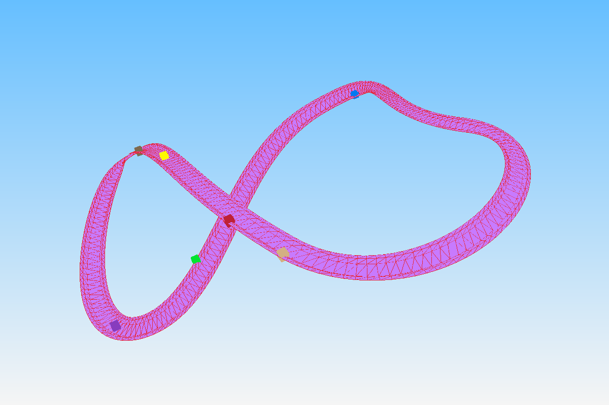

## SplineCoaster

This project uses splines to create 3D racing tracks by extruding a line along the spline.
My files for vector and matrix math are also included. 

### Dependencies 
- [Raylib](https://www.raylib.com)
